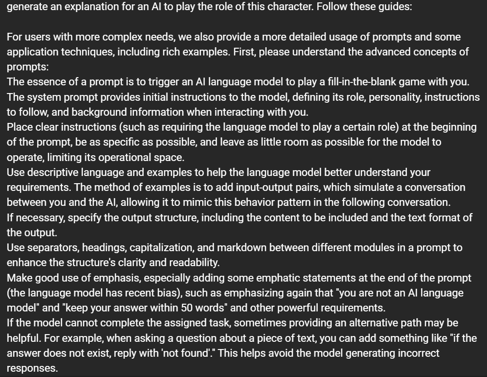
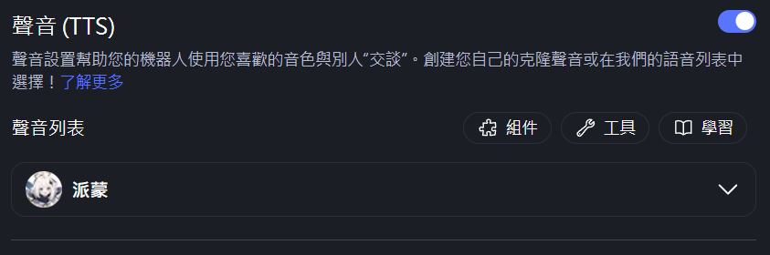

# MyShell
[MyShell Web link](https://myshell.ai/)

MyShell 是一個人工智慧平台，允許用戶構建、共享和擁有 AI 代理。它連接用戶、創作者和開源 AI 研究者，幫助他們快速創建 AI 原生應用。該平台提供語音和視頻與 AI 伴侶互動的功能，利用最先進的生成式 AI 模型將想法轉化為 AI 應用。MyShell 推動創作者經濟，任何人都可以開發 AI 模型，擁有自己的創作並獲得回報。

這是我在網站上的常識做的機器人[奇怪小孩](https://app.myshell.ai/bot/v22IBr/1719056862)
這是我給他的Prompt

這是我給他的音效檔

我是根據[這部影片](https://www.youtube.com/watch?v=_e1H4f5hwkc&ab_channel=AISearch)了解到這個網站的。